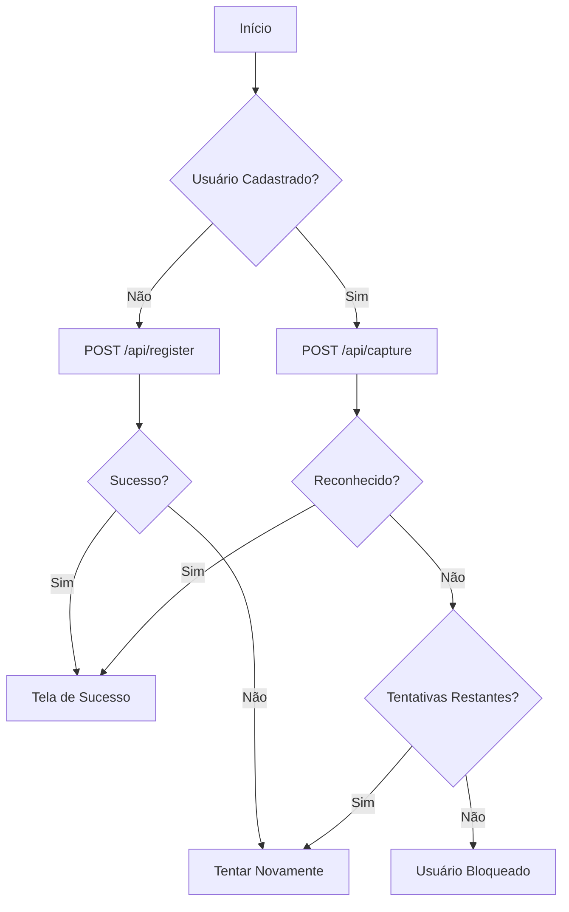

# Documentação da API

Esta pasta contém a documentação completa da API do backend usando OpenAPI 3.0 (Swagger).

## Visualizar a Documentação

### Opção 1: Swagger Editor Online

1. Acesse [Swagger Editor](https://editor.swagger.io/)
2. Clique em `File` → `Import file`
3. Selecione o arquivo `swagger.yaml`
4. A documentação será renderizada automaticamente

### Opção 2: Swagger UI Local

Instale e execute o Swagger UI localmente:

```bash
# Instalar swagger-ui-express
npm install swagger-ui-express yamljs

# Adicionar ao seu servidor Express (já configurado se seguir instruções abaixo)
```

### Opção 3: VS Code com Extensão

1. Instale a extensão "OpenAPI (Swagger) Editor" no VS Code
2. Abra o arquivo `swagger.yaml`
3. Clique com botão direito → "Preview Swagger"

## Integrar Swagger UI no Servidor

Para servir a documentação Swagger diretamente do servidor backend:

### 1. Instalar Dependências

```bash
cd backend
npm install swagger-ui-express yamljs
```

### 2. Adicionar ao `src/index.ts`

```typescript
import swaggerUi from 'swagger-ui-express';
import YAML from 'yamljs';
import path from 'path';

// Carregar documentação Swagger
const swaggerDocument = YAML.load(path.join(__dirname, '../swagger.yaml'));

// Adicionar rota para documentação
app.use('/api-docs', swaggerUi.serve, swaggerUi.setup(swaggerDocument, {
  customCss: '.swagger-ui .topbar { display: none }',
  customSiteTitle: 'API de Reconhecimento Facial - Documentação'
}));

console.log('📚 Documentação da API disponível em: http://localhost:4000/api-docs');
```

### 3. Acessar a Documentação

Após iniciar o servidor:

```bash
npm run dev
```

Acesse: **http://localhost:4000/api-docs**

## Estrutura da API

### Endpoints Principais

#### Health Check
- `GET /health` - Verificar saúde do servidor
- `GET /api/config` - Obter configuração atual (debug)

#### Gerenciamento de Usuário
- `POST /api/user` - Verificar se usuário está cadastrado
- `POST /api/register` - Cadastrar novo usuário com dados faciais

#### Reconhecimento Facial
- `POST /api/capture` - Processar identificação facial

### Códigos de Erro

| Código | Descrição |
|--------|-----------|
| `INVALID_REQUEST` | Dados de requisição inválidos |
| `SERVER_ERROR` | Erro interno do servidor |
| `MAX_ATTEMPTS_EXCEEDED` | Tentativas máximas excedidas |
| `LIVENESS_CHECK_ERROR` | Fraude detectada (spoof) |

### Fluxo de Autenticação



## Exemplos de Uso

### Verificar Cadastro de Usuário

```bash
curl -X POST http://localhost:4000/api/user \
  -H "Content-Type: application/json" \
  -d '{
    "user_id": "347313"
  }'
```

**Resposta:**
```json
{
  "registered": true,
  "timestamp": "2025-11-27T10:30:00.000Z"
}
```

### Cadastrar Novo Usuário

```bash
curl -X POST http://localhost:4000/api/register \
  -H "Content-Type: application/json" \
  -d '{
    "user_id": "347313",
    "imageData": "data:image/jpeg;base64,/9j/4AAQSkZJRg..."
  }'
```

**Resposta (Sucesso):**
```json
{
  "success": true,
  "timestamp": "2025-11-27T10:30:00.000Z"
}
```

**Resposta (Fraude Detectada):**
```json
{
  "success": false,
  "timestamp": "2025-11-27T10:30:00.000Z",
  "error": "Tentativa de fraude! Certifique-se de usar um rosto real!",
  "errorCode": "LIVENESS_CHECK_ERROR",
  "attemptsRemaining": 4
}
```

**Resposta (Tentativas Excedidas):**
```json
{
  "success": false,
  "timestamp": "2025-11-27T10:30:00.000Z",
  "error": "Número máximo de tentativas de cadastro excedido. Por favor, aguarde antes de tentar novamente.",
  "errorCode": "MAX_ATTEMPTS_EXCEEDED",
  "attemptsRemaining": 0,
  "minutesRemaining": 2
}
```

### Processar Identificação

```bash
curl -X POST http://localhost:4000/api/capture \
  -H "Content-Type: application/json" \
  -d '{
    "userId": "347313",
    "imageData": "data:image/jpeg;base64,/9j/4AAQSkZJRg...",
    "timestamp": 1732704600000
  }'
```

**Resposta (Reconhecido):**
```json
{
  "success": true,
  "data": {
    "recognized": true,
    "confidence": 95,
    "userId": "347313",
    "timestamp": "2025-11-27T10:30:00.000Z",
    "attemptsRemaining": 99
  }
}
```

**Resposta (Não Reconhecido):**
```json
{
  "success": true,
  "data": {
    "recognized": false,
    "confidence": 45,
    "userId": "347313",
    "timestamp": "2025-11-27T10:30:00.000Z",
    "attemptsRemaining": 4
  }
}
```

## Testar a API

### Usando Postman

1. Importe o arquivo `swagger.yaml` no Postman
2. Postman converterá automaticamente para uma coleção
3. Configure a variável `baseUrl` para `http://localhost:4000`
4. Execute as requisições

### Usando Insomnia

1. Importe o arquivo `swagger.yaml` no Insomnia
2. Insomnia criará automaticamente as requisições
3. Configure o ambiente base para `http://localhost:4000`
4. Execute as requisições

### Usando Thunder Client (VS Code)

1. Instale a extensão Thunder Client
2. Importe o arquivo `swagger.yaml`
3. Configure a URL base
4. Execute as requisições

## Validação de Schema

A documentação Swagger inclui validação de schema para:

- Tipos de dados
- Campos obrigatórios
- Formatos de string (data URI, timestamps)
- Valores mínimos/máximos
- Enums para códigos de erro

## Atualizações

Ao adicionar novos endpoints ou modificar existentes:

1. Atualize o arquivo `swagger.yaml`
2. Valide usando [Swagger Validator](https://validator.swagger.io/)
3. Teste os endpoints
4. Atualize esta documentação se necessário

## Recursos Adicionais

- [OpenAPI Specification](https://swagger.io/specification/)
- [Swagger Editor](https://editor.swagger.io/)
- [Swagger UI](https://swagger.io/tools/swagger-ui/)
- [OpenAPI Generator](https://openapi-generator.tech/)
